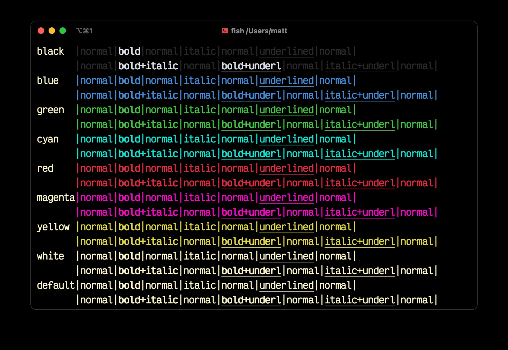

# iTerm2

1. Open iTerm2 and go to `Profiles`, then `Colors`, and then press the `Color Presets...` button in the bottom right.
2. Go down to the bottom and press `Import...`.
3. Open the [blackbird.itermcolors](./blackbird.itermcolors) file.
4. Enjoy blackbird!
