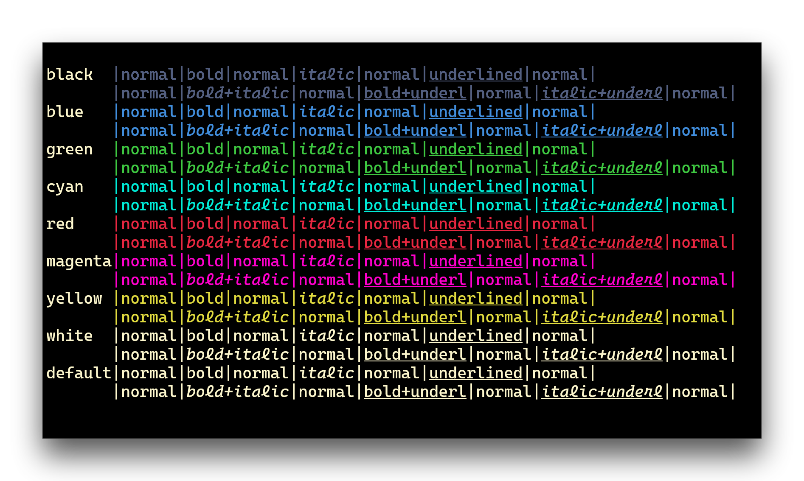

# Windows Terminal

1. Open your Windows Terminal config file by pressing `Ctrl+Shift+,`.
2. Copy the contents of the [blackbird.json](./blackbird.json) into the
   `schemes` array inside your config file.
3. Either set the `profiles.defaults.colorScheme` value to `blackbird` inside
   your config file or select it in the settings UI, which you can open by
   pressing `Ctrl+,`.
